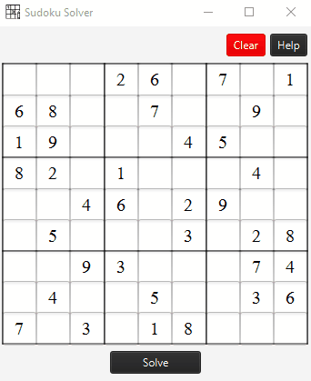
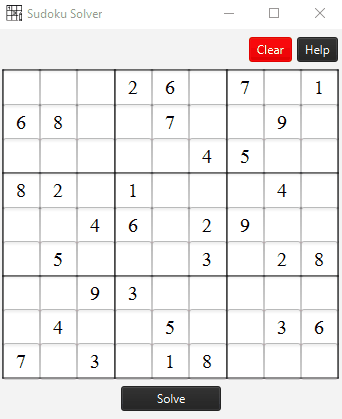
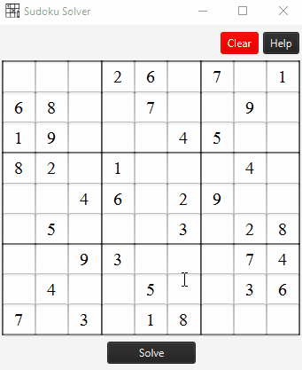
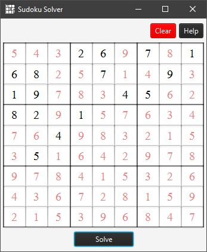

# javafx-sudoku-solver

Sudoku solver with backtracking (Java FX)

## Demo 0 
Default sudoku grid values are provided for demonstration.

## Demo 1
Customize sudoku by editing the digits.

## Demo 2 
Clear the sudoku grid and provide a desired sudoku configuration.

17 or more clues need to be provided (The Minimum Number of Clues Problem)

